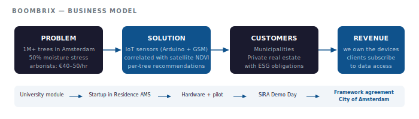
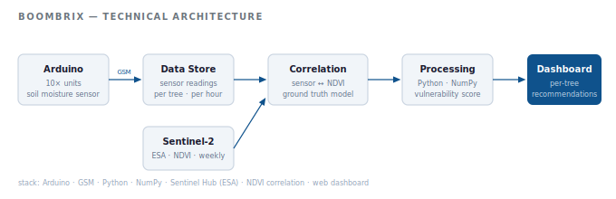

# BOOMBRIX — IoT Tree Health Monitoring for Cities

> Co-founders: Jakub Supera & Noelle Teh · Startup in Residence Amsterdam · 2018–2019

---

Amsterdam manages over 1,000,000 trees. Around 50% suffer from moisture stress during dry periods — yet the only way to know which ones need water was to send an arborist (€40–50/hr) to check manually. Neither scalable nor fast enough to prevent loss.

Satellite imagery exists, but it can't tell you what's happening below the surface. We built BOOMBRIX to close that gap.

---

## Business Model

---

## Technical Architecture

---

## What We Built

A hardware-software system combining underground soil moisture sensors with satellite NDVI data to give city managers precise, per-tree watering recommendations — updated continuously, no arborist needed.

Each BOOMBRIX unit: Arduino-based sensor, GSM transmission, installed within the first 500mm of soil with minimal surface disturbance. Sensor data was correlated with Sentinel satellite indices to build a ground-truth model that neither data source could produce alone.

The output: a dashboard telling you exactly which trees are vulnerable, and when to act.

---

## Who It's For

**Municipalities** managing urban forests at scale — Amsterdam was our first customer, but the model applies to any city managing significant tree stock.

**Private real estate holdings** with landscaping obligations or sustainability commitments — where healthy trees have direct asset value.

---

## Business Model

We own the devices. Clients subscribe to the data. This means recurring revenue, continuous sensor data ownership, and a defensible position as the dataset grows — ground-truth data that competitors using satellite-only approaches simply don't have.

---

## Pilot

**Location:** Rapenburgerstraat, Amsterdam · **Scale:** 9 trees · 8 weeks

Key findings:
- Observable soil moisture differences at street-level granularity
- Measurable variance between tree pit designs at different depths (-5cm/-10cm vs -20cm)
- Ground sensor data successfully validated and enriched satellite NDVI readings

---

## Journey & Outcome

University entrepreneurship module → competitive Startup in Residence Amsterdam selection → hardware iterations → paid pilot → Demo Day → **framework agreement with the City of Amsterdam**

Case owner: Jaike Bijleveld, Senior Advisor Asset Management Green, Gemeente Amsterdam

---

*"Not all conditions are possible to check via satellite even if already existing technology provides accurate data on tree development."*  
— ir. Joop Spiker, Wageningen Environmental Research
