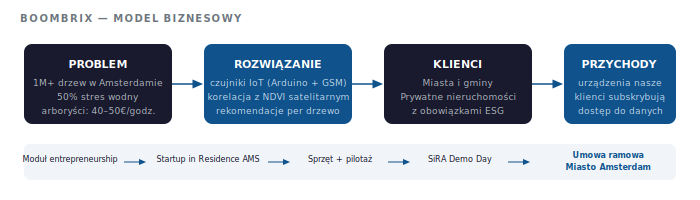

# BOOMBRIX — Monitoring zdrowia drzew miejskich w oparciu o IoT

> Współzałożyciele: Jakub Supera & Noelle Teh · Startup in Residence Amsterdam · 2018–2019

---

Amsterdam zarządza ponad milionem drzew. Około 50% z nich cierpi na stres wodny podczas suchych okresów — a jedynym sposobem na sprawdzenie, które wymagają podlewania, był kosztowny inspektor (€40–50/godz.) wykonujący ręczne kontrole. Ani skalowalne, ani wystarczająco szybkie.

Dane satelitarne istniały, ale nie mówiły nic o tym, co dzieje się pod ziemią. BOOMBRIX powstał, żeby wypełnić tę lukę.

---

## Model biznesowy

---

## Architektura techniczna

---

## Co zbudowaliśmy

System sprzętowo-programowy łączący podziemne czujniki wilgotności gleby z satelitarnymi indeksami NDVI — dostarczający zarządcom miast precyzyjne rekomendacje podlewania dla każdego drzewa z osobna, aktualizowane na bieżąco, bez potrzeby angażowania inspektorów.

Każda jednostka BOOMBRIX: czujnik oparty na Arduino z transmisją GSM, instalowany w pierwszych 500mm gleby przy minimalnym naruszeniu nawierzchni. Dane z czujników korelowaliśmy z satelitarnymi indeksami Sentinel, budując model weryfikacji naziemnej, którego żadne z tych źródeł danych nie mogło dostarczyć samodzielnie.

Wynik: dashboard pokazujący dokładnie które drzewa są zagrożone i kiedy należy działać.

---

## Dla kogo

**Miasta i gminy** zarządzające miejskim drzewostanem na dużą skalę — Amsterdam był naszym pierwszym klientem, ale model sprawdza się w każdym mieście z dużą liczbą drzew.

**Prywatni właściciele nieruchomości** z obowiązkami w zakresie zieleni lub zobowiązaniami ESG — gdzie zdrowe drzewa mają bezpośrednią wartość majątkową.

---

## Model biznesowy

Urządzenia pozostają nasze. Klienci subskrybują dostęp do danych. To oznacza przychody cykliczne, ciągłą własność danych z czujników i ugruntowaną pozycję w miarę jak baza danych rośnie — dane naziemne, których konkurenci oparci wyłącznie na satelitach po prostu nie posiadają.

---

## Pilotaż

**Lokalizacja:** Rapenburgerstraat, Amsterdam · **Skala:** 9 drzew · 8 tygodni

Kluczowe wnioski:
- Mierzalne różnice wilgotności gleby nawet w skali jednej ulicy
- Różnice między typami misek drzewnych na różnych głębokościach (-5cm/-10cm vs -20cm)
- Dane naziemne skutecznie walidowały i wzbogacały odczyty satelitarnego NDVI

---

## Droga i wynik

Moduł entrepreneurship na studiach → selekcja do Startup in Residence Amsterdam → iteracje sprzętowe → płatny pilotaż → Demo Day → **umowa ramowa z Miastem Amsterdam**

Opiekun projektu: Jaike Bijleveld, Starszy Doradca ds. Zarządzania Zielenią, Gemeente Amsterdam

---

*„Nie wszystkie warunki da się sprawdzić satelitarnie, nawet jeśli istniejące technologie dostarczają dokładnych danych o stanie drzew."*  
— ir. Joop Spiker, Wageningen Environmental Research
